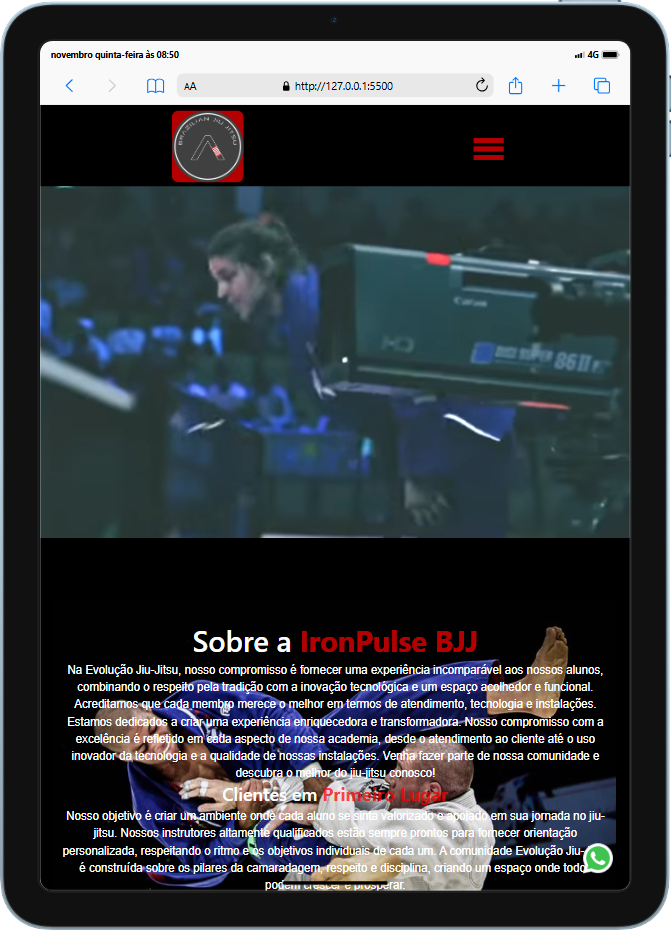

# Academia IronPulse Brazilian Jiu-Jitsu

    
    
    

## O projeto
O projeto foi desenvolvido em html, css e javascript. Com a finalidade de uma academia de jiu-jitsu divulgar o seu trabalho e atrair mais alunos através de sua página web.

## Cores
Não foi ultilizado muitas cores, por ser uma arte marcial. Então desenvolve-se uma paleta dos seguintes hexadecimal(cores):
- #000000(black)
- #ffffff(white)
- #ff0000b4(shade of Red)
    - E algumas variações de transparencia desse vermelho

## Tipografia
 Usada em todo o projeto uma font-family "Arial Sans-serif"

## Lista de Tarefas Realizadas
- [x] Estrutura HTML
- [x] Donwload de imgs e vídeos
- [x] Estrutura CSS
- [x] Responsividade
- [x] Realizar primeiro commit
- [x] Adicionar Iteração com javascript
- [x] Estruturar README
- [x] Segundo Commit
- [x] Hospedar o projeto

## Confira aqui ↧
 "Aqui vai o link do site hospedado"

## Desenvolvedor 
 Gusttavo Soares, Front-end developer. 

 
 
 

 ## Tecnologias Ultilizadas 
 
 
 

 

